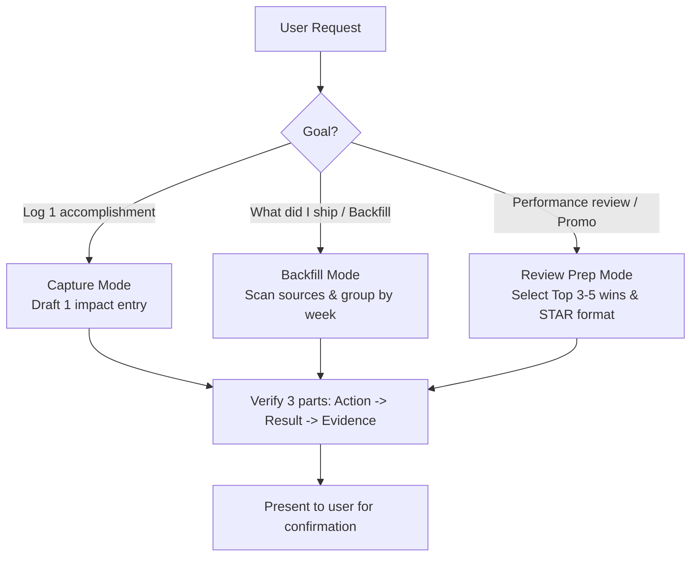

# Brag Sheet — Work Impact Writer

## Overview

Turn raw engineering activity into concise, evidence-backed impact statements for performance reviews, self-assessments, promo packets, and weekly updates. Uniquely mines Antigravity session transcripts, git history, and PRs to reconstruct forgotten work.

**Violating the letter of the rules is violating the spirit of the rules.** Every entry must strictly provide verifiable evidence or an explicit placeholder; never invent metrics or embellish claims.

## When to Use



Use when the user needs to:
- Capture a single completed task or bug fix with evidence
- Reconstruct work history from git commits, PRs, or Antigravity sessions ("What did I do last week?")
- Prepare promotion packets, self-assessments, or annual/mid-year reviews
- Frame engineering output around customer value and business impact
- Generate weekly status reports grouped by week and category

DO NOT use for:
- Sprint planning or story pointing
- Project management or task assignment
- Real-time time tracking
- Creating Jira/issue tickets

## Core Pattern

Every entry uses impact-first framing with three required parts:

```
Did [action] → [result/impact] → [evidence]
```

**Do not output an entry unless it includes all three parts.** If evidence is missing, ask for it or mark as `(evidence needed)`.

### Anti-Patterns

| Avoid | Preferred |
|-------|-----------|
| "Fixed a bug in auth" | "Fixed token refresh race condition → eliminated 401s affecting 12% of API calls → PR #247" |
| "Worked on dashboards" | "Built latency dashboard in Grafana → on-call detects P95 spikes in <2min → deployed to prod" |
| Invent a metric: "saved 40% of eng time" | Ask: "Do you have a rough estimate, or should I keep this qualitative?" |
| One entry per commit | Group related commits into one entry with highest-impact framing |
| Passive voice: "The pipeline was improved" | Active voice: "Built CI matrix → caught Windows-only bug before release" |
| List technologies used | State the outcome: "Migrated 4 services to IaC → deploy time 45min → 8min" |
| Silently drop weak entries | Mark `(evidence needed)` and present for user to fill in |

### Evidence Ladder

Not every entry needs a metric. Use the strongest evidence available:

| Level | Strength | Evidence type | Example |
|-------|----------|---------------|---------|
| 1 | Best | Quantified metric | "Reduced P95 latency from 800ms to 120ms" |
| 2 | Strong | PR, commit, or doc link | "PR #312, design doc in wiki" |
| 3 | Good | Observable outcome | "Unblocked Team X", "Resolved Sev2 incident Y" |
| 4 | Acceptable | Qualitative + context | "Reduced toil for on-call rotation — see updated runbook" |
| 5 | Weak | Activity only | "Worked on auth" — reframe or mark `(evidence needed)` |

Never invent a metric to fill the gap. Qualitative evidence with context beats fabricated numbers.

## Quick Reference

### Operational Modes

| User wants... | Mode | Output |
|---------------|------|--------|
| Log one accomplishment | **Capture** | 1 impact-first entry |
| "What did I do last week?" | **Backfill** | Entries grouped by week, mined from git/PRs/sessions |
| Prep for review or promo | **Review Prep** | Entries grouped by impact theme + STAR narratives |

### Categories

| ID | Category | Use for |
|----|----------|---------|
| `pr` | PRs & Features | Merged PRs, shipped features |
| `bugfix` | Bug Fixes | Bug fixes, incident patches |
| `infrastructure` | Infrastructure | Infra, deployments, migrations |
| `investigation` | Investigation | Root cause analysis, debugging |
| `collaboration` | Collaboration | Reviews, mentoring, design discussions |
| `tooling` | Tooling & Automation | Dev tools, scripts, automation |
| `oncall` | Incident & On-Call | Incident response, on-call wins |
| `design` | Architecture & Design | Design docs, architecture decisions |
| `documentation` | Documentation | Docs, runbooks, guides |

### Sub-Skills

**RECOMMENDED SUB-SKILL:** Use `kien-thai` whenever drafting, backfilling, or summarizing work in Thai.

## Implementation

### Decision Tree for Data Sources

1. **If `save_to_brag_sheet` tool is available** → use extension tools directly (`save_to_brag_sheet`, `review_brag_sheet`, `generate_work_log`). Do not reference or attempt to call these tools unless they are confirmed available.
2. **If git or gh CLI is available** → backfill from commits and PRs (see Backfill Workflow below).
3. **Otherwise** → guided interview: "What did you work on?", "Who benefited?", "What's the evidence?"

### Backfill Workflow

Follow these steps in order. **Do not draft entries until scanning is complete.**

#### Step 1: Scan available sources
Check availability and mine each source:
```bash
git --version 2>/dev/null                                   # for commit mining
gh --version 2>/dev/null                                    # for PR mining
ls -d ~/.gemini/antigravity-cli/brain/*/ 2>/dev/null | head # Antigravity session directories
```

- **Git commits** (user commits in current repo):
  ```bash
  git log --author="$(git config user.email)" --since="2 weeks ago" \
    --pretty=format:'%h|%ad|%s' --date=short --no-merges
  ```
- **PR history** (merged PRs across repos):
  ```bash
  gh pr list --author @me --state merged --limit 20 \
    --json number,title,repository,mergedAt
  ```
- **Antigravity session history**:
  - Path: `~/.gemini/antigravity-cli/brain/<conversation-id>/.system_generated/logs/transcript.jsonl`
  - Extract tool activity (`write_to_file`, `replace_file_content`, `run_command`) and workspace paths.
  - Skip sessions without meaningful code changes.

#### Step 2: Group related work
Cluster related signals into one entry:
- Same PR + its commits → 1 entry
- Multiple commits on the same file/feature within 3 days → 1 entry
- Antigravity sessions on the same repo + branch → merge into PR entry

#### Step 3: Draft entries
Write impact-first entries (`action → result → evidence`) for each group and assign categories.

#### Step 4: Present and refine
Show all drafted entries to the user. Adjust based on user feedback. Never auto-save silently.

#### Step 5: Output
Format markdown grouped by week:
```markdown
## Week of 2025-04-14

### PRs & Features
- **Migrated auth service to managed identity** → eliminated 3 secret rotation incidents/quarter → PR #312

### Infrastructure
- **Built CI pipeline for brag-sheet plugin** → 107 tests across 3 OSes x 3 Node versions → shipped v1.0.0
```

### Performance Review Prep

When the user is preparing for a performance review (annual review, mid-year review, promotion packet):
1. **Gather**: Collect entries from the work log or backfill.
2. **Select**: Pick the top 3–5 highest-impact wins.
3. **Rewrite**:
   - **What I did**: Specific action taken
   - **Why it mattered**: Who benefited, what changed
   - **Proof**: PR number, metric delta, dashboard link, customer outcome
4. **Organize** by impact theme (Delivering results, Customer/team impact, Leadership, Technical growth).
5. **Narrative format**: Use STAR (**S**ituation → **T**ask → **A**ction → **R**esult).

### Thai Language Support (kien-thai Integration)

When writing, backfilling, or summarizing brag sheet entries and review packets in Thai:
1. **Invoke the `kien-thai` skill if available** before drafting Thai prose.
2. **Apply core kien-thai structural frames:**
   - **Topic-Comment (F1):** Front the topic over SVO. Avoid non-adversative passive "ถูก-" (no "ถูกพัฒนา", "ถูกสร้าง", "ถูกปรับปรุง"). State the actor or action directly.
   - **Condition/Time Leading (F2):** Place conditions and temporal frames at the front of clauses ("พอ traffic ขึ้น...", "เมื่อเริ่มรอบประเมิน...").
   - **Natural Spacing (F3):** Use spaces and line breaks for sentence boundaries; do not append periods (`.`) after Thai sentences.
   - **Closure Particles (F4):** Close additive or contrastive clauses with proper particles (`ด้วย`, `แล้ว`, `ต่างหาก`) to avoid dangling thoughts.
   - **Zero Anaphora (F5):** Drop redundant pronouns once the topic is established. Never use dummy pronouns like "มัน".
   - **Pacing with "ก็" (F6):** Use "ก็" for natural rhythmic flow and cause-and-effect transitions.
   - **Pivots (F7):** Use simple "แต่" or demonstrative bridges ("ตรงนี้แหละที่...") instead of formal connective stacks ("อย่างไรก็ตาม", "ทั้งนี้").
3. **Voice & Register:** Default to Professional / Tech Explainer. Zero emojis, objective tone, and active verbs.
4. **Technical Jargon:** Keep industry-standard developer terms in English script or standard transliteration (`deploy`, `cache`, `API`, `query`, `streaming`, `PR`, `commit`, `OOM`).

## Discipline Rules & Loophole Closures

**No exceptions:**
- **DO NOT use emojis anywhere.** No emojis in titles, headings, categories, bullet points, or entries. Clean plain-text formatting only.
- **DO NOT fabricate metrics.** If the user does not provide a metric, do not guess, estimate, or invent a percentage or latency number. Use qualitative Level 2–4 evidence or write `(evidence needed)`.
- **DO NOT silently omit evidence.** If evidence is unknown, you must write `(evidence needed)`.
- **DO NOT draft before scanning is complete.** When backfilling, run all source discovery commands first.
- **DO NOT auto-save without confirmation.** Always present drafted entries to the user for explicit approval.
- **DO NOT create one entry per commit.** Group related commits into a single cohesive entry.

## Rationalization Table

| Excuse | Reality |
|--------|---------|
| "The user wants it to look impressive, so I'll estimate 40% time saved." | Fabricating metrics destroys credibility. Use Level 2-4 evidence (PR link, unblocked team) or mark `(evidence needed)`. |
| "The user didn't give me a link, so I'll just write action and result." | All entries require 3 parts. Mark `(evidence needed)` so the gap is visible and can be filled. |
| "Adding emojis like rockets or sparkles makes the document look modern." | Emojis look unprofessional in formal performance packets. Use clean, plain-text markdown only. |
| "It's faster to start drafting immediately and scan git history later." | Drafting before scanning produces incomplete, duplicate, or hallucinated entries. Scan first. |
| "Every commit represents work done, so each gets its own bullet." | Reviewers want business impact, not commit churn. Ten commits on one feature equal one entry. |
| "The user told me to log it, so I'll write to file directly to save a step." | Always show drafts to the user for review before saving. Never commit unconfirmed entries. |
| "I'm following the spirit of impact by making up a plausible number." | Violating the letter of the rules is violating the spirit of the rules. Plausible lies are still lies. |

## Red Flags - STOP and Start Over

- Fabricating or guessing any metric, percentage, or latency delta
- Outputting an entry missing any of the 3 parts (action → result → evidence)
- Using emojis anywhere in the output
- Drafting entries before source scanning is complete
- Writing one bullet per commit instead of clustering related work
- Auto-saving or finalizing without user review
- Adding filler entries to pad light periods

**All of these mean: STOP. Reframe the entry or ask the user for verification.**

## Common Mistakes

### What goes wrong: No recent commits in current repo
- **Symptom:** Git log returns empty or only initial commit.
- **Fix:** Check `gh pr list --author @me --state merged` for cross-repo work, ask if another repo was used, or switch to the guided interview.

### What goes wrong: Review period does not match git history
- **Symptom:** Git history only has the last week, but review covers the full half or year.
- **Fix:** Explicitly set `--since` and `--until` flags on `git log`, or rely on PR history which spans longer timeframes.

### What goes wrong: User cannot quantify impact
- **Symptom:** User says "I don't know the exact number" and feels stuck.
- **Fix:** Refer to the Evidence Ladder. Strong qualitative evidence (PR link, runbook update, unblocking another engineer) is completely valid. Never force a fake metric.

### What goes wrong: Antigravity session directory is absent
- **Symptom:** `ls ~/.gemini/antigravity-cli/brain/` returns not found.
- **Fix:** Silently skip Antigravity session scanning and proceed with git and PR mining.

### What goes wrong: Ambiguous "brag" command
- **Symptom:** User says "brag to my team" intending a Slack launch announcement rather than a work log.
- **Fix:** Confirm intent: "Would you like an internal launch announcement or an impact-first brag sheet entry?"

### What goes wrong: Pair programming or co-authored commits
- **Symptom:** Multiple authors on commit log.
- **Fix:** Ask: "Should I credit this as your primary work, co-authored collaboration, or omit it?"

## Automatic Session Tracking (Optional)

For automatic background tracking of coding sessions (files edited, PRs created, git actions), install the brag-sheet plugin. It captures tool events silently via lifecycle hooks and maintains structured receipts of your work.
